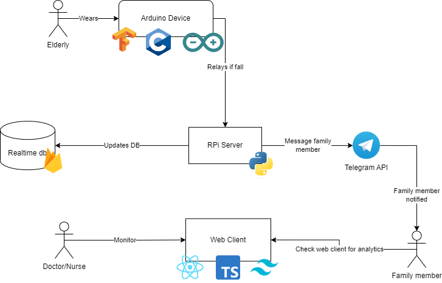
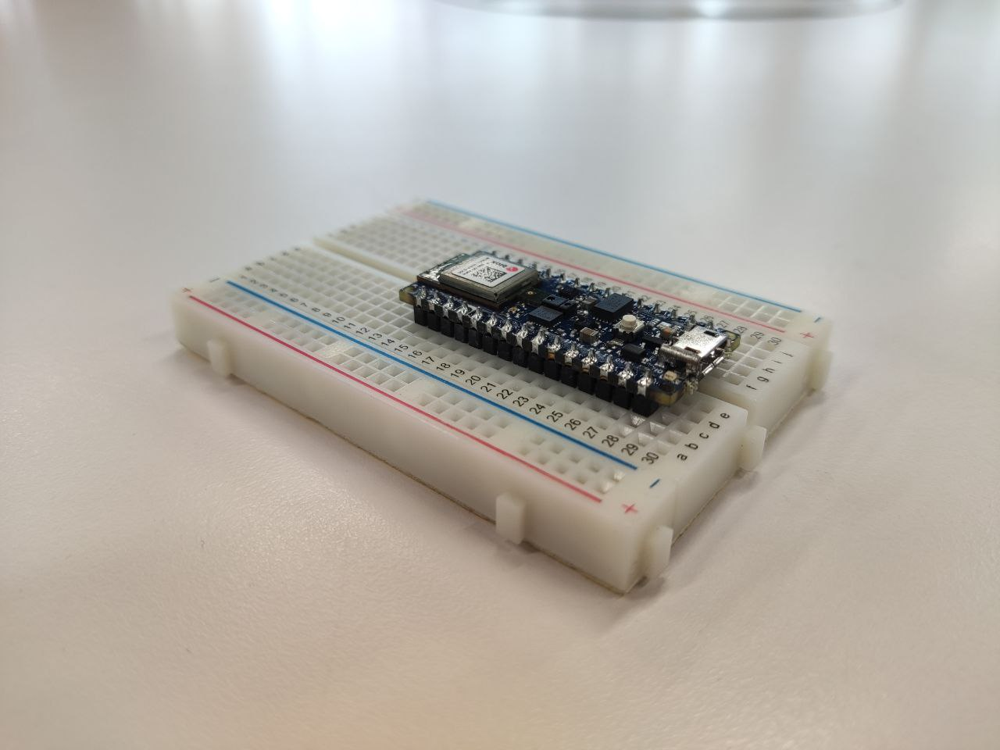
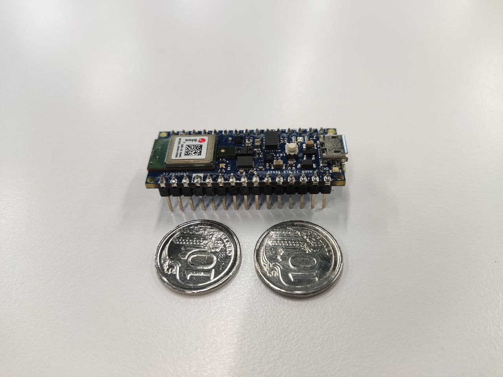
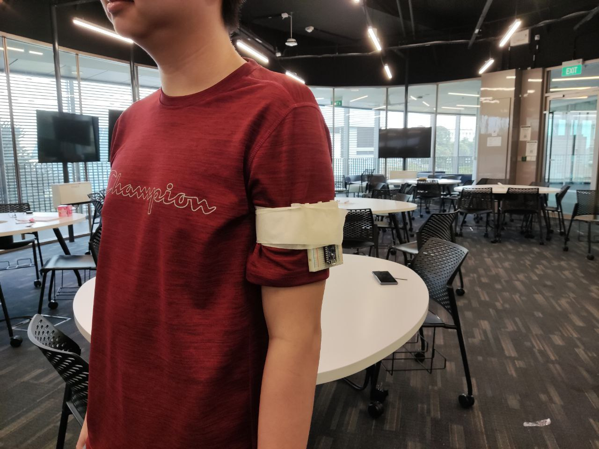
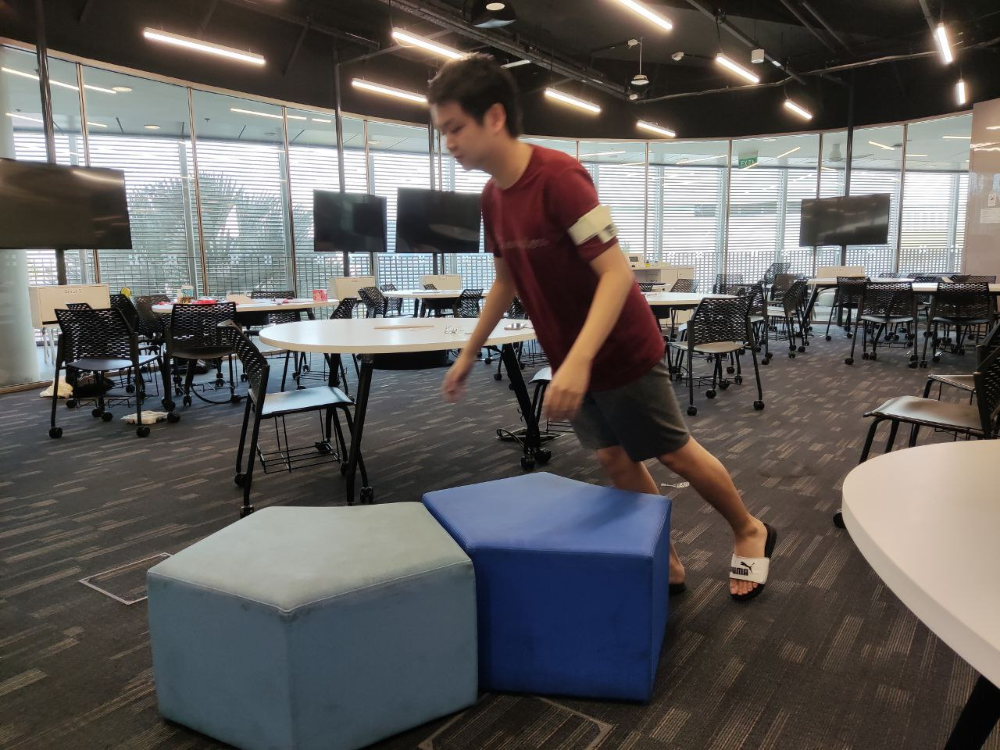
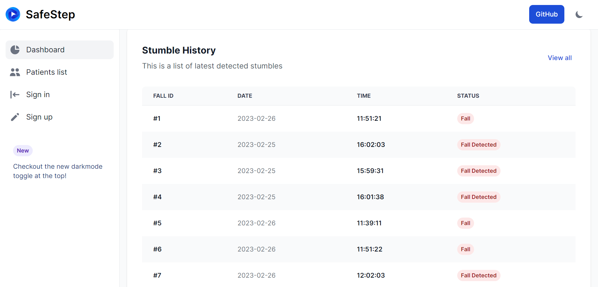
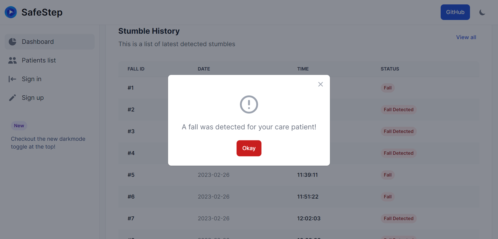
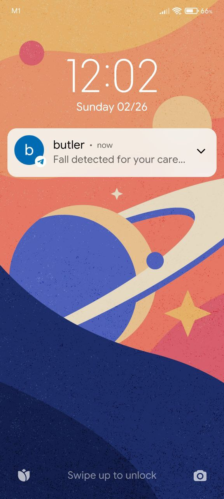

# SafeSteps

## 📖 Overview
- 23.8% of Singaporeans will be aged 65 and above by 2030
- More than 1 in 4 elderly experiences a fall annually
- Falls are especially dangerous for the elderly
- Timely assistance could prevent the exacerbation of injuries
- It would be useful to see who is more prone to falls

## 💡 What it does
- SafeSteps is a wearable IoT device that can be strapped to the arm
- Detects when the wearer falls
- Immediately sends a Telegram message to family member alerting them
- Also displays falls in a dashboard to see if elderly are very prone to falling, thus requiring more care
- Allows doctors/nurses to also monitor all patients under their care

## 🛠️ How it was built
- We used edge-computing to perform computation on a low-performant device using embedded-C.
- We used an Arduino board and used Tensorflow-lite to deploy a Machine Learning model in it.
- Fall detection is performed within the Arduino itself.
- We wrote python scripts to a RPi server. Arduino sends data to RPi through serial communication.
- RPi server is connected to the internet and calls updates the Firebase realtime database.
- RPi also calls the Telegram API to send text to the family member.
- Family members/doctors can monitor falls through a web client.
- They can see past history of falls to see if an elderly is more prone to falls, thus getting more attention.
- Web client was built using React, Typescript, Tailwindcss.
- When a fall occurs, the client get a push notification as well.

### Application Architecture:

### 🏷️ Features

Arduino board

Able to provide high classification despite being the size of two 10¢ coins

Wearable device on the arm for least obstruction

Detects falling motion

Web client to see fall history

Push notification when fall detected

Notification to Telegram when fall detected

View the presentation slides: [here](https://docs.google.com/presentation/d/e/2PACX-1vSJeOw8KLRakesKPEGnFp0DGCtCOXtDSc4LEjiDSzc49gd4yT7DtWOCcceC3zgQa_U1ViXx2yKjNA4j/pub?start=false&loop=false&delayms=3000)

View the project demo: [here](https://youtu.be/S3QsxDu5bw4)

---
> This project was built during the iNTUition v9.0 Hackathon. SafeSteps won the hackathon in 2nd place! 🥳 View the DevPost submission [here](https://devpost.com/software/safesteps-kcevrm)